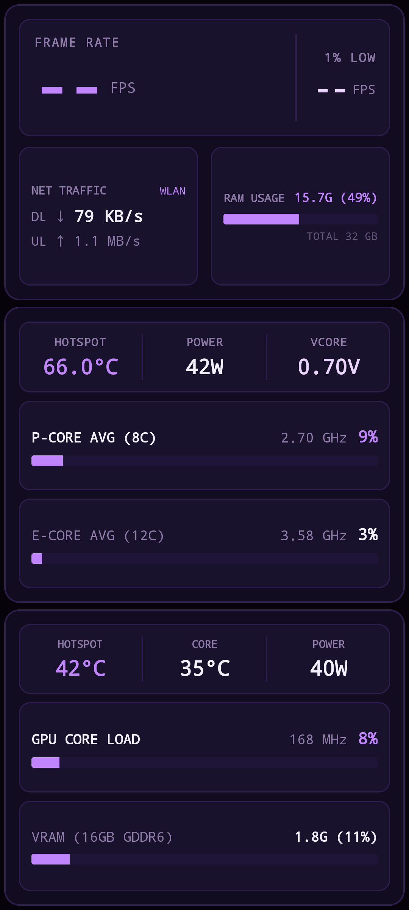

# CyberHUD-BTMonitor 🚀
### 赛博机甲风 // 纯蓝牙直连 PC 性能监控副屏系统

[](https://github.com)
[](https://github.com)
[](LICENSE)

将闲置的安卓手机（测试机型为 Redmi Note 10 Pro 2400×1080）打造成专属的**赛博机甲风 (Lavender Cyber HUD) 桌面硬件监控副屏**。

<div align="center">
  
</div>

---

## ✨ 核心特性

1. **纯硬件级蓝牙直连 (RFCOMM / SPP)**
   * **完全不需要局域网、Wi-Fi 路由器或手机热点**。即便在断网环境下，只要电脑手机开着蓝牙即可稳定以 1000ms 频率双向推流。
2. **纯粹的垂直监控美学 (Lavender Cyber HUD)**
   * 专为 **2400×1080 (20:9)** 竖屏打造，三大核心模块（帧率网络/CPU/GPU）均匀三等分对称排列。
   * 采用高对比度**薰衣草紫 (`#C084FC`)** 机甲配色，字号全部放大翻倍（主数值 20sp ~ 56sp），即使放置在 1 米开外的桌面支架上也能清晰一眼扫过。
   * **无缝穿透挖孔与隐藏导航栏**：深度沉浸式全屏，内容直接顶格铺满物理屏幕四角，无任何黑边。
3. **真实硬件底层传感器精准直读**
   * **CPU (Intel Core Ultra 7 265KF / Arrow Lake)**：通过内核级 WinRing0 驱动读取 CPU 核心结温（MSR 0x19C）、封装功耗（W）、核心电压（VCore）；结合 Windows PDH 接口读取 P 核 / E 核实时动态睿频与负载。
   * **GPU (AMD Radeon RX 7800 XT)**：通过 LibreHardwareMonitor ADL 驱动读取 GPU 结温（Hotspot）、核心温度、整卡功耗、实时核心频率（MHz）、核心负载、16GB 显存已用与占用率。
   * **系统级指标**：双向网络流量速率（DL/UL）、物理内存已用与占比。
   * 轮询开销极低：CPU 占用率低于 0.05%，零性能损耗。
4. **极致轻量原生 Android App**
   * 原生 Java SDK 开发，无任何第三方大体积依赖，最终打包生成的 Release APK 仅约 **20 KB**！

---

## 🚀 快速上手教程（三步使用）

### 第一步：手机端准备
1. 确保手机已开启蓝牙。
2. 从 [Releases 页面](../../releases) 下载安装 `PCMonitor.apk`。
3. 打开手机上的 **「PC硬件监控」**（软件会自动保持屏幕常亮并全屏沉浸，初始显示 `--` 等待连接）。

### 第二步：电脑端配置
1. 复制根目录下的 `config.example.json` 为 `config.json`：
   ```json
   {
     "phone_bt_mac": "XX:XX:XX:XX:XX:XX",
     "rfcomm_port": 5
   }
   ```
   *将 `phone_bt_mac` 替换为你手机的实际蓝牙 MAC 地址（可在手机设置 -> 关于手机 -> 状态信息 -> 蓝牙地址中查看）。*

### 第三步：一键推流
双击运行根目录下的：
```bat
start_bt_monitor.bat
```
*（脚本会自动申请管理员权限以读取 CPU 底层 MSR 结温驱动，并自动建立蓝牙推流）*

终端显示 `[CONNECTED!]` 后，手机副屏即刻以 1 秒一次的速率动态刷新硬件数据！

---

## 🛠️ 项目目录结构

```text
├── start_bt_monitor.bat        # 【一键启动】日常使用直接双击运行
├── preview.png                 # 真机运行效果图
├── config.example.json         # 蓝牙 MAC 配置模板
├── pc_sender/
│   ├── hardware_monitor.py     # 硬件采集核心 (WinRing0 + ADL + PDH + psutil)
│   └── bt_monitor_sender.py    # 蓝牙 RFCOMM 串口推流客户端
├── android_app/                # 手机端原生 App 源码工程
│   ├── build_apk.ps1           # 一键免 Android Studio 编译、对齐与签名脚本
│   └── src/main/               # AndroidManifest、MainActivity、布局与配色
├── lhm/                        # LibreHardwareMonitor 核心驱动库依赖
└── README.md                   # 本文档
```

---

## 📜 许可证

本项目采用 [MIT License](LICENSE) 开源协议。
